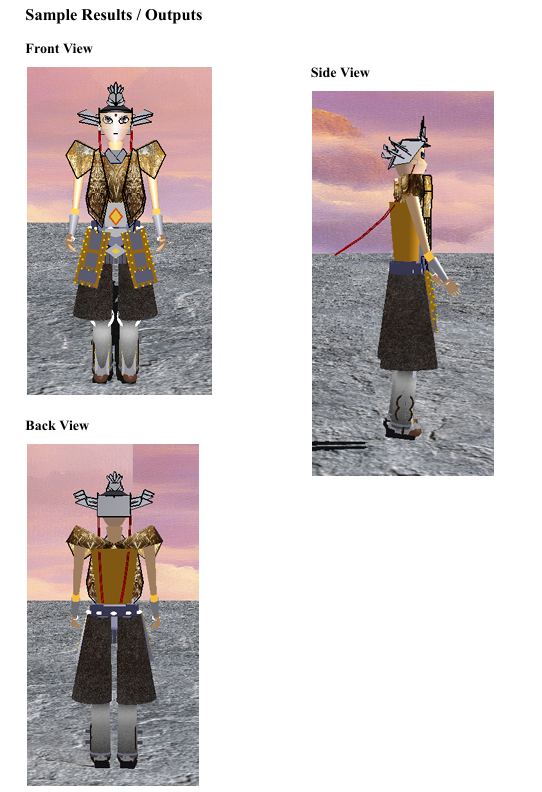
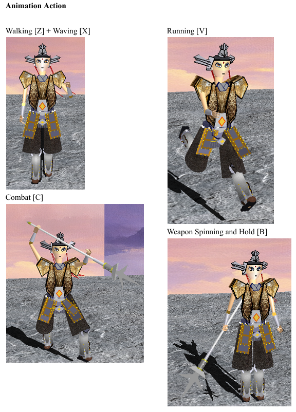
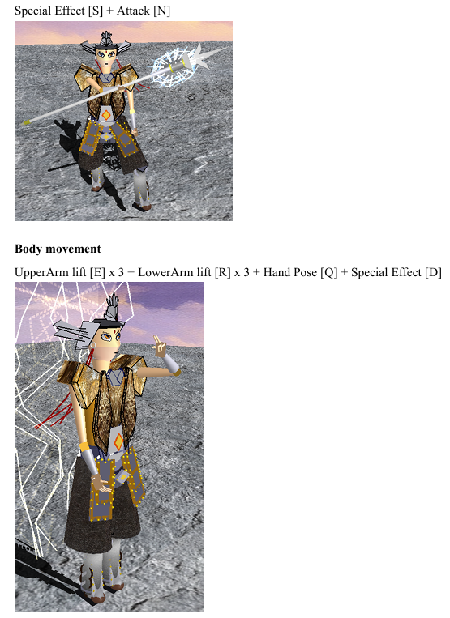

# Erlang Shen 3D Character Prototype

A 3D interactive graphics application developed in C++ with Win32 and OpenGL for a Graphics Programming assignment. The project presents a fully interactive prototype of **Erlang Shen (二郎神 杨戬)**, designed as a potential character concept for a sequel to *Ne Zha 2*.

---

## Project Overview

This project implements a real-time 3D character prototype using raw Win32 and OpenGL fixed-function pipeline techniques. The character is modeled with multiple geometric primitives and supports animation, camera interaction, projection switching, lighting controls, background changes, and style customization.

The prototype is inspired by the mythological warrior Erlang Shen, known for his third eye, divine spear, and strong martial identity. The goal of the project is to combine technical graphics programming concepts with a character-driven interactive presentation.

## Features

- Interactive 3D character rendering in C++
- Perspective and orthographic projection switching
- Mouse and keyboard camera controls
- Upper body and lower body articulated movement
- Walking, running, combat, and weapon animations
- Special effects such as electrical weapon effect and thunder aura
- Armor style customization
- Face / eye style switching
- Environment background switching
- Lighting toggles for ambient, diffuse, and specular light
- Background music support

## Character Concept

The project is based on **Erlang Shen**, a warrior god from Chinese mythology. The design highlights:
- the iconic third eye
- headgear ornaments and battle ribbons
- layered armor with multiple visual themes
- the three-pointed, double-edged spear
- combat-ready poses and divine visual effects

According to the report, the prototype was created as an interactive 3D visualization aligned with the mythological style of the *Ne Zha* universe. :contentReference[oaicite:1]{index=1}

---

## Technologies Used

- C++
- OpenGL
- GLU
- Win32 API
- Visual Studio 2022

The system specification in the report states that the project was developed in Visual Studio 2022 using C++ and OpenGL, with keyboard and mouse input for interaction and GLU helpers for 3D construction. :contentReference[oaicite:2]{index=2}

## Project Structure

```text
GPAssignment/
├── main.cpp
├── GPAssignment.sln
├── GPAssignment/
│   ├── main.cpp
│   ├── GPAssignment.vcxproj
│   ├── GPAssignment.vcxproj.filters
│   ├── armor.bmp
│   ├── armor2.bmp
│   ├── armor3.bmp
│   ├── background1.bmp
│   ├── background2.bmp
│   ├── background3.bmp
│   ├── blue.bmp
│   ├── blue2.bmp
│   ├── blue3.bmp
│   ├── chinesearmor.bmp
│   ├── chinesearmor2.bmp
│   ├── chinesearmor3.bmp
│   ├── ground.bmp
│   ├── orange.bmp
│   ├── orange2.bmp
│   ├── orange3.bmp
│   ├── silverMetal.bmp
│   ├── trouser.bmp
│   └── bgm.mp3
└── .gitignore
```

---

## Sample Output (Character Prototype C++)





---

## Controls

### General

- Esc — Quit
- Space — Full reset
- / — Toggle world axes
- M — Toggle user manual
- Camera and View
- P — Toggle perspective / orthographic projection
- Left mouse drag — Rotate view
- Right mouse drag — Pan view
- Mouse wheel / + / - — Zoom in / out
  
### Lighting
- J — Toggle ambient light
- K — Toggle diffuse light
- L — Toggle specular light
- ; / ' — Orbit light around character

### Environment
- 5, 6, 7 — Switch background
- H — Toggle background music
- Style and Customization
- 1, 2, 3, 4 — Switch armor themes
- 8, 9 — Switch face / third-eye settings
  
### Animation
- Z — Walking
- X — Waving
- C — Combat stance
- V — Running
- B — Raise, spin, and hold weapon
- N — Attack
- A — Ribbon movement

### Body Movement
- Q — Hand pose
- W — Thumbs up pose
- E — Upper arm lift
- R — Lower arm lift
- T — Upper leg lift
- Y — Knee bend
- U — Foot bend
- I — Head shake
- O — Head nod

### Special Effects
- S — Electrical weapon effect
- D — Thunder / lightning aura
- F — Triangle sigil mode

These controls are documented in the user manual section of the report.

---

## Graphics and Design Highlights

The report describes several major graphics features:
- configurable ambient, diffuse, and specular lighting
- textured skydome and tiled ground
- multiple armor themes
- dynamic weapon choreography
- runtime customization of pose and appearance
- camera projection toggling
- movement animations such as walking and running

## Polygon Complexity

The report includes a polygon count analysis showing the full character and environment total about 125,585 triangle equivalents, with the lower body being the most polygon-intensive part.

---

## How to Run
1. Open GPAssignment.sln in Visual Studio 2022
2. Build the project in Debug or Release mode
3. Run the application
4. Use keyboard and mouse controls to interact with the character
   
## Notes
- This project was built for Windows using Visual Studio and Win32
- The .vs folder should not be uploaded to GitHub
- Texture and audio assets must remain in the expected project directory for the program to load correctly

## Academic Context

This project was developed for BMCS2173 Graphics Programming. The assignment required a 3D interactive graphics application using an appropriate graphics API.

## Author
- Wong Jin Xuan
- Tan Yen Ping
- Dorcas Lim
